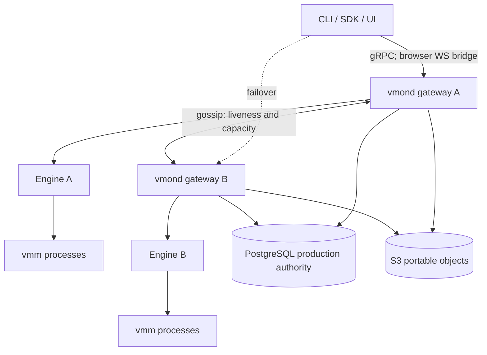

# Vibemon mesh architecture

The contract for the vmon compute mesh: ownership, epochs, placement,
durability tiers, eligibility rules, and defaults. This document is normative —
when code and this document disagree, one of them is a bug. Each invariant
stated here is (or must become) a mechanical assertion in the test suite; the
gated cluster e2e (`tests/cluster_e2e.rs`) is the hardware-level
arbiter. User-facing docs live in README.md.

## System shape

Every node runs `vmon serve`: one Rust axum/tonic gateway, one `Engine`, a
local gRPC Unix socket, and zero or more child `vmon vmm` processes. Clients
hold an ordered gateway roster in a context and may enter through any live
gateway; the gateway proxies owner-bound calls.

Gossip carries membership, liveness, capacity, and development-mode
anti-entropy. `cluster_mode=production` delegates ownership and lifecycle
transactions to PostgreSQL and portable object bytes to S3.
`cluster_mode=single-node` is the default and has only best-effort
gossip/epoch fencing when multiple development nodes are joined.

## Ownership, epochs, and leases

- Every sandbox has one owner node. The owner runs the VMM and is the only node
  allowed to serve or mutate it.
- Ownership carries a monotonic epoch. In production, PostgreSQL allocates and
  compares epochs in the same transactions that mutate ownership. In
  development mode, persisted local epochs converge through gossip.
- Every production owner also holds a PostgreSQL TTL lease. Renewal returns
  database-measured remaining TTL; the node arms a watchdog before expiry.
  Missing that deadline stops the VMM and drops local routing authority.
- Restore, rollback, and migration candidates cannot serve until the exact
  ownership epoch and lease are committed. A stale candidate is torn down.
- Production migration records source intent and a token before transfer,
  commits the target owner transactionally, fences the source, then activates
  the target. Retries converge on the committed owner.
- Development gossip epochs are best-effort fencing, not mutual exclusion.
  Writable shared state requires the lease mechanism below.

## Placement

Placement is **request-scoped, never ingress-scoped**.

- `arch` is an optional request selector. It is **not defaulted from the
  client or ingress machine** — a Mac client targets an x86 Linux pool without
  ceremony. When unspecified, the coordinator derives candidate arches from
  the image manifest (multi-arch refs resolve per-node) intersected with node
  kernel/agent capabilities, and places across every compatible pool.
- Backend (`kvm`/`hvf`) and CPU-baseline gates are hard filters **only where
  existing state is reused**: snapshot/template restore, fork, migration,
  replica restore. Fresh boots gate on arch and capabilities only.
- The ingress gateway proxies create and owner-bound calls to the selected node.
- `score_node` biases toward warm pools and templates, free capacity, locality,
  and region, and penalizes inflight work. Scores select among eligible
  candidates; they never override a hard gate.
- `hrw_score` deterministically picks idempotency coordinators, replica
  targets, and restore owners. Rendezvous assignment is placement, never
  mutual exclusion.

## Durability contract

Durability is tiered and stated in RPO/RTO terms. Per-sandbox tier selector:
`ha = off | async | rerun | async+rerun`.

### Metadata and lifecycle authority

In production, PostgreSQL stores create records, idempotency keys, owners,
epochs, owner leases, lifecycle state, suspend markers, rollback pins,
migration intent, and deletion tombstones. Acknowledgement follows the
transaction commit. PostgreSQL is therefore a hard serving dependency:
failure to renew an owner lease self-fences the local VM rather than silently
falling back to node-local authority.

In development meshes, create records are copied before acknowledgement. With
at least three expected members a strict majority is required. A two-node mesh
requires every currently live peer but lets a lone survivor accept locally;
this is explicitly weaker than majority authority.

### Guest state (`ha=async`) — explicit RPO/RTO

- Production publishes encrypted checkpoints/replicas to S3, verifies them,
  then commits their PostgreSQL manifest. Uncommitted bytes are neither listed
  nor restorable.
- Development mode pushes non-destructive checkpoints to rendezvous-ranked
  peers.
- **RPO** is the checkpoint cadence. Work after the latest committed
  checkpoint is lost on owner failure.
- **RTO** is failure detection plus compatible-host restore time.

### Re-run (`ha=rerun`) — at-least-once compute

If no usable checkpoint exists, a fenced successor re-executes the durable
create record. Semantics are at-least-once: work must tolerate re-execution.
`async+rerun` prefers checkpoint restore and falls back to rerun.

### Durable lifecycle and recovery history

- Pause is in-memory only. Suspend captures a full checkpoint, commits a
  suspended marker, then removes the live VM. Resume restores the exact marker.
  Failed publication or commit leaves the source authoritative.
- Recovery history has independent `disk` and `checkpoint` tiers in
  production. Disk capture quiesces only the block worker and rollback
  cold-boots. Checkpoint capture preserves VM execution state.
- Rollback pins its immutable target and stages a replacement before cutover.
  Failure retains the current source. Delete uses a tombstone and replayable
  object cleanup.

### Writable volumes — fenced leases only

Production grants volume leases in PostgreSQL. Development meshes use
strict-majority peer voting. Both bind holder and epoch, require renewal before
expiry, self-fence writers on missed renewal, and prevent a successor from
activating while the prior lease remains valid. Writable mesh volumes require
at least three expected members. Read-only volumes need no write lease.

### Quorum restore

Automatic restore requires a strict majority of expected membership to confirm
the former owner unreachable when quorum protection is enabled. Expected
membership is a high-water mark and is not reduced by reaping. Restore is
deferred for quorum shortfall, a reachable owner, incompatible placement,
missing object/key/secret, or stale ownership claim.

## Rejection over degradation

Anything unplaceable or unprotectable is rejected at create with a
machine-readable reason (`EngineError.code`), never silently accepted into a
weaker tier. Create-time rejections on mesh contexts:

| Condition | Code | Reason |
| --- | --- | --- |
| `fs_dir` host share | `invalid` | Host-local state cannot be placed or protected; use a volume. |
| Writable volume on a <3-node mesh | `unsupported` | No quorum possible for the lease. |
| `arch` selector matching no live pool | `unplaceable` | No compatible capacity. |
| Mixed live arches and an underivable image arch | `arch_required` | Caller must pass `arch=...` so placement is explicit. |

There is no remaining legacy networked/user-net HA carve-out. Linux TAP and
macOS user-net sandboxes are checkpoint/restore eligible: checkpoints carry the
network spec, Linux restore allocates a fresh TAP, and macOS restore reopens
slirp with serialized guest-visible NAT state. Host-side TCP flows still reset.

## Defaults

| Knob | Default | Notes |
| --- | --- | --- |
| Cluster mode | `single-node` | `production` must be explicit and requires PostgreSQL, S3, and a shared non-default key. |
| Metadata commit | Always on for mesh creates | PostgreSQL transaction in production; peer record acknowledgement in development. |
| Tier | Mesh `async`; local `off` | `async+rerun` adds the rerun fallback. |
| Replica cadence | 60 seconds on mesh | Zero disables asynchronous replica capture. |
| Replica fan-out | 1 | `replicas` config. |
| History cadence | disk 300s; checkpoint 3600s | Independently configurable; zero disables that tier. |
| Quorum restore | On at ≥3 expected members | Two-node default is off with a warning. |
| Placement `arch` | Image manifest ∩ node capabilities | Never inferred from ingress/client architecture. |

Configuration is one `vmon serve` surface: defaults, optional TOML, environment,
then flags.

## Client plane

One `Transport` protocol, two implementations:

- **local** — Unix socket to `vmond` (auto-started). No token.
- **mesh** — ordered gateway roster from a named context + bearer token.

Failover semantics are shared by the CLI and all three SDK drivers:

- Replay-safe calls (reads, idempotent writes, detached create/restore with
  idempotency keys) walk the roster and retry only on
  connection-establishment failure (`code == "unreachable"` / `OSError`).
- Non-replay-safe and interactive ops (attached run/exec/shell, snapshot,
  fork, extend) probe `/healthz` to pick a live gateway once, then run
  **exactly once**. A delivered request is never duplicated.
- Hard boundary, stated as such: a cached roster tolerates gateway loss only
  while at least one saved endpoint is reachable. "All gateways down" has no
  client-side answer by construction.

The SDK (`Sandbox`, `@function`) and the CLI share this transport. There is no
raw daemon TCP protocol and no legacy client fallback file: a named context is
the only non-local transport.

## Non-goals (recorded so they stay dead)

- External identity-provider integration or general RBAC beyond the admin,
  restricted-client, and tenant-token scopes.
- GPU passthrough.
- Autoscaling into clouds.
- An in-process consensus implementation. Production deliberately relies on
  PostgreSQL transactions/leases; development meshes expose only their stated
  gossip guarantees.
- Built-in NAT traversal / overlay networking. Nodes and clients must reach
  advertise URLs; WireGuard/Tailscale is the documented answer for machines
  behind NAT.
