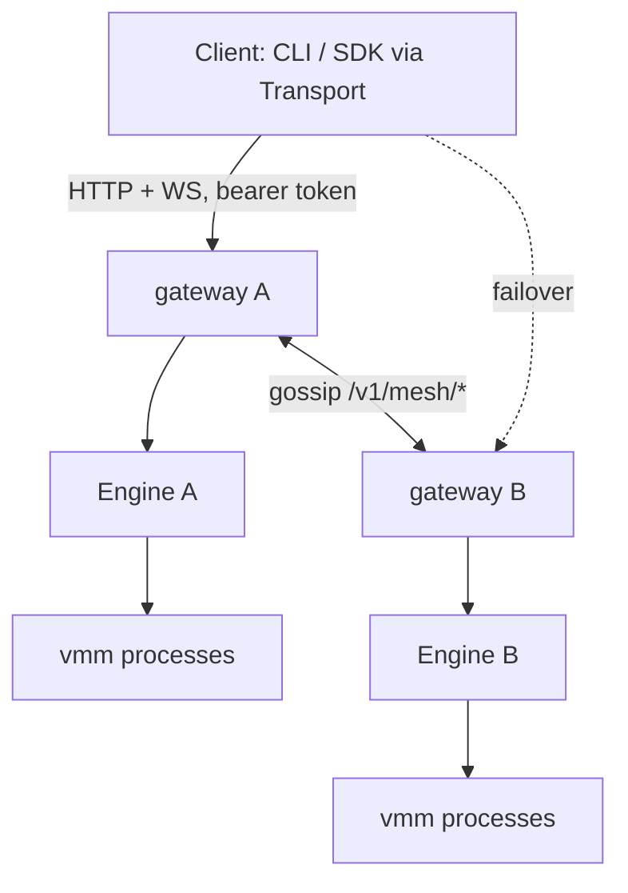

# Vibemon mesh architecture

The contract for the vmon compute mesh: ownership, epochs, placement,
durability tiers, eligibility rules, and defaults. This document is normative —
when code and this document disagree, one of them is a bug. Each invariant
stated here is (or must become) a mechanical assertion in the test suite; the
gated cluster e2e (`python/tests/test_cluster_e2e.py`) is the hardware-level
arbiter. User-facing docs live in README.md.

## System shape

Every node runs `vmon serve`: one FastAPI gateway + one `Engine` (the only
state owner on that node) + the local `vmond` Unix socket. Nodes gossip
membership over `/v1/mesh/heartbeat`; there is no leader and no consensus
store. Clients hold an ordered gateway roster (a *context*) and talk to any
live gateway; the gateway proxies to the sandbox owner.

A gossip mesh with asynchronous replicas cannot promise consensus-grade
guarantees. This document states exactly what each tier buys and never
pretends otherwise.

## Ownership and epochs

- Every sandbox has exactly one **owner node**. The owner runs the VMM process
  and is the only node that mutates sandbox state.
- Ownership carries an **epoch** (monotonic integer). Every owner claim is
  resolved by highest `(epoch, node_id)` (`Mesh._consider_owner`). Migration
  and crash restore claim ownership at `next_epoch()` and broadcast it
  (`Mesh.broadcast_owner`).
- Local epochs are persisted (`Engine.set_owner_epoch`) so a rebooted node
  that lost a fencing race **self-fences**: `ha_reconcile_forever` stops local
  sandboxes superseded by a higher authoritative epoch
  (`Mesh.fenced_local_ids`).
- Fencing is **best-effort**, bounded by the gossip convergence window. It
  bounds split-brain to the partition window and converges on rejoin; it is
  not mutual exclusion. Anything that needs true single-writer semantics
  (writable volumes) must use quorum leases, not epochs alone.

## Placement

Placement is **request-scoped, never ingress-scoped**.

- `arch` is an optional request selector. It is **not defaulted from the
  client or ingress machine** — a Mac client targets an x86 Linux pool without
  ceremony. When unspecified, the coordinator derives candidate arches from
  the image manifest (multi-arch refs resolve per-node) intersected with node
  kernel/agent capabilities, and places across every compatible pool.
- Backend (`kvm`/`hvf`) and CPU-baseline gates are hard filters **only where
  existing state is reused**: snapshot/template restore, fork, migration,
  replica restore. Fresh boots gate on arch and capabilities only.
- The ingress gateway proxies the create to a compatible owner; the same
  proxy plumbing (`_mesh_router`, `_proxy_websocket`) serves every
  post-create operation.
- Scoring (`score_node`) biases toward warm pools and templates, free
  capacity, locality, and region, and penalizes inflight work. Scores select
  among *eligible* candidates; they never override a hard gate.
- Rendezvous hashing (`_hrw_score`) deterministically picks idempotency
  coordinators, replica targets, and restore owners. Rendezvous assignment is
  *placement*, never mutual exclusion.

## Durability contract

Durability is tiered and stated in RPO/RTO terms. Per-sandbox tier selector:
`ha = off | async | rerun | async+rerun`.

### Metadata — synchronous, guaranteed

The create record (sid, spec, owner, epoch, idempotency key) is replicated
**before the create is acked** (201). On meshes with ≥3 expected members, a
strict majority must hold the record. On a 2-node mesh the implemented tier is
weaker: every live peer must ack, and with no live peer the local node accepts
the record so the survivor can keep serving creates. Guarantee after ack:
**no surviving gateway ever answers "unknown sid" for that create.** Every
gateway resolves sids from the record store, not only from gossip, and
anti-entropy re-pushes locally owned records to live peers.

### Guest state (`ha=async`) — explicit RPO/RTO

- **RPO** = replication cadence: the owner checkpoints eligible sandboxes
  non-destructively each cadence and pushes to the top-K rendezvous-ranked
  peers. Surfaced per-sandbox as checkpoint age in `mesh status`.
- **RTO** = failure-detection window (heartbeat interval × reap threshold)
  plus restore time.
- Never advertised as zero-loss. Work since the last checkpoint is lost on
  owner crash, by contract.

### Re-run (`ha=rerun`) — at-least-once compute

If the owner dies with no usable checkpoint, a surviving node re-executes the
create from the durable create record. Semantics: **at-least-once, never
concurrent with a fenced predecessor** (the re-run claims a higher epoch
first). This is the tier that makes "nothing acked evaporates" true for
re-runnable compute without synchronous memory replication. `async+rerun`
prefers checkpoint restore and falls back to re-run.

### Writable volumes — quorum-fenced leases only

Single-writer holds only when a lease is granted and renewed by a strict
majority of expected members, epoch-fenced, with TTL self-fencing. For every
grant or renewal, `renew_deadline = granted_at + ttl / 2`; a different holder
cannot receive a vote until `successor_grant_allowed_at = granted_at + ttl`.
The owner stops writers on renewal failure once the deadline is missed, before
any successor can activate. Requires ≥3 nodes; on 2-node meshes, writable
volumes are **rejected at create** on mesh contexts — no silent degradation.
Read-only volumes are unrestricted (divergence-free by construction). The
host-local `flock` in `Volume.acquire` protects same-host concurrency only and
is not a cluster mechanism.

### Quorum restore — majority of expected membership

Auto-restore of an orphaned sandbox requires a strict majority of the
*expected* cluster (high-water mark, never shrunk by reaping) to confirm the
former owner unreachable (`GET /v1/mesh/reachable/{node}`). A 2-node mesh
cannot form a post-failure majority and **defers** when quorum restore is on.
If restore cannot safely complete (wrong electee, prior owner still reachable,
missing replica, missing secrets, or quorum shortfall), the orphan is requeued
for the next reconciliation pass. Best-effort epoch fencing remains available
below quorum and is labeled best-effort everywhere it appears.

## Rejection over degradation

Anything unplaceable or unprotectable is rejected at create with a
machine-readable reason (`EngineError.code`), never silently accepted into a
weaker tier. Create-time rejections on mesh contexts:

| Condition | Code | Reason |
| --- | --- | --- |
| `fs_dir` host share | `invalid` | Host-local state cannot be placed or protected; use a volume. |
| Writable volume on a <3-node mesh | `unsupported` | No quorum possible for the lease. |
| `arch` selector matching no live pool | `unplaceable` | No compatible capacity. |
| Mixed live arches and an underivable image arch | `arch_required` | Caller must pass `arch=...` so placement is explicit. |

There is no remaining legacy networked/user-net HA carve-out. Linux TAP and
macOS user-net sandboxes are checkpoint/restore eligible: checkpoints carry the
network spec, Linux restore allocates a fresh TAP, and macOS restore reopens
slirp with serialized guest-visible NAT state. Host-side TCP flows still reset.

## Defaults

| Knob | Default | Notes |
| --- | --- | --- |
| Metadata commit | **Always on** for mesh contexts | Not configurable; it is the contract. |
| Tier | `ha=async`, cadence auto-derived | Was opt-in via `VMON_REPLICATE_SEC`; a default deployment must have stated durability. |
| Replica fan-out | K=1 | `replicas` config. |
| Quorum restore | **On** at ≥3 expected members | At 2 nodes: off by default, with a warning in the mesh status payload. |
| Placement `arch` | Derived from image manifest ∩ node capabilities | Never from ingress/client arch. |

Configuration is one `vmon serve` config surface (flags + optional file);
environment variables are overrides only.

## Client plane

One `Transport` protocol, two implementations:

- **local** — Unix socket to `vmond` (auto-started). No token.
- **mesh** — ordered gateway roster from a named context + bearer token.

Failover semantics (frozen; verified by `test_mesh_failover.py`):

- Replay-safe calls (reads, idempotent writes, detached create/restore with
  idempotency keys) walk the roster and retry only on
  connection-establishment failure (`code == "unreachable"` / `OSError`).
- Non-replay-safe and interactive ops (attached run/exec/shell, snapshot,
  fork, extend) probe `/healthz` to pick a live gateway once, then run
  **exactly once**. A delivered request is never duplicated.
- Hard boundary, stated as such: a cached roster tolerates gateway loss only
  while at least one saved endpoint is reachable. "All gateways down" has no
  client-side answer by construction.

The SDK (`Sandbox`, `@function`) and the CLI share this transport. There is no
raw daemon TCP protocol and no legacy client fallback file: a named context is
the only non-local transport.

## Non-goals (recorded so they stay dead)

- Multi-tenancy beyond the two token tiers (`VMON_API_TOKEN`,
  `VMON_CLIENT_TOKEN`).
- GPU passthrough.
- Autoscaling into clouds.
- A consensus store. Leaderless gossip + rendezvous + majority probes/leases
  is the right weight for 2–10 node meshes; this document states exactly what
  that buys and what it does not.
- Built-in NAT traversal / overlay networking. Nodes and clients must reach
  advertise URLs; WireGuard/Tailscale is the documented answer for machines
  behind NAT.
