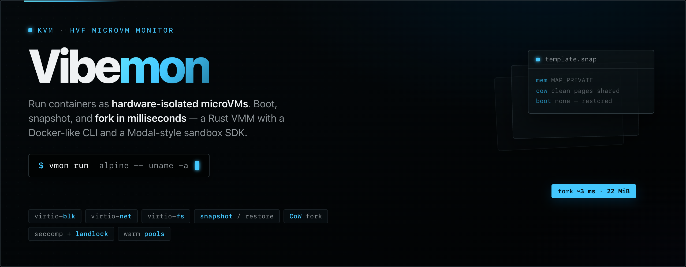
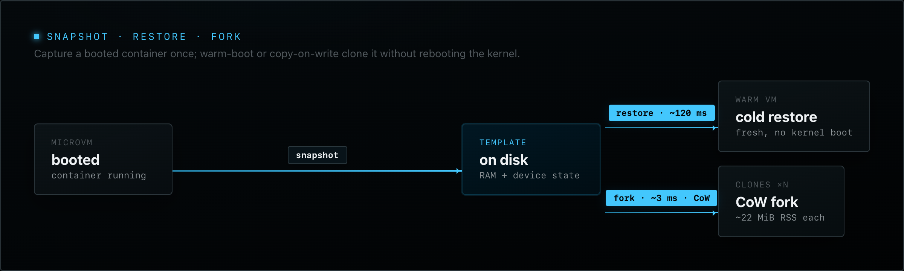
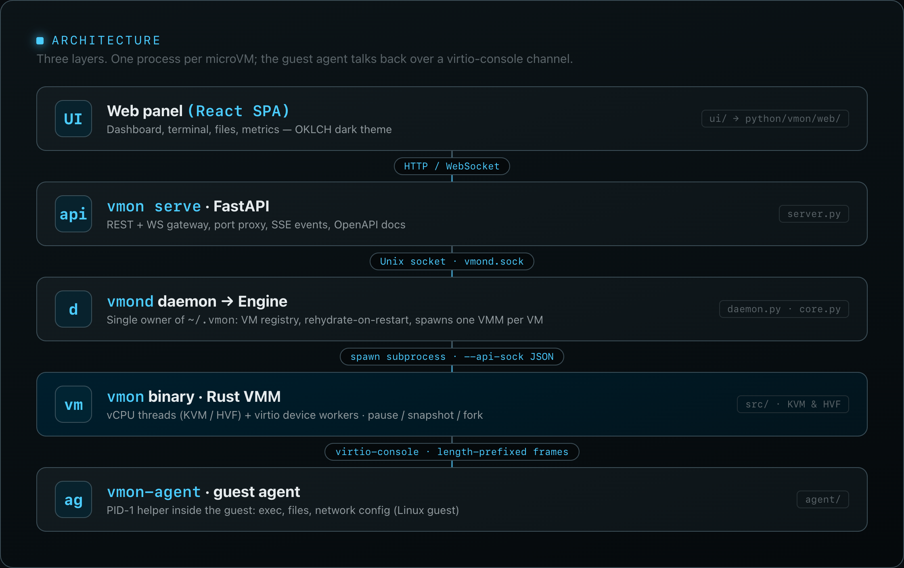

<p align="center">
  
</p>

# Vibemon

`vmon` is a small KVM/HVF-based virtual machine monitor for Linux guests. It boots containers as hardware-isolated microVMs, snapshots them to disk, and forks copy-on-write clones in milliseconds — pairing a Rust VMM core with a Docker-like Python CLI, a Modal-style sandbox SDK, a daemon, a REST/WebSocket server, and a React web panel.

<p align="center">
  
</p>

## Quickstart

```sh
# Build the Rust VMM binary
just release                      # target/release/vmm

# Install the Python CLI + SDK
pip install -e python/

# Run a container as a microVM (Linux + /dev/kvm)
vmon run alpine -- sh -c 'echo hello from a microVM; uname -a'

# Snapshot, warm-boot, and fork
vmon snapshot myvm tpl --stop
vmon restore tpl --name warm      # ~120 ms
vmon fork tpl --count 5           # ~3 ms per CoW clone
```

On macOS without KVM, you can still launch the web panel and REST API:

```sh
cd ui && bun install && bun run build
cd ../python && pip install -e '.[server]'
vmon serve --host 127.0.0.1 --port 8000 --token secret
# open http://127.0.0.1:8000
```

## Architecture

<p align="center">
  
</p>

Five runtime layers. The Python daemon spawns one Rust `vmon` process per microVM; the guest agent runs inside the VM and talks back over a virtio-console channel.

```
Web UI (React SPA)
   │ HTTP / WebSocket
vmon serve (FastAPI, server.py)
   │ Unix socket  $VMON_HOME/vmond.sock
vmond (daemon.py) ──> Engine (core.py, single registry owner)
   │ spawns subprocess per VM, --api-sock JSON control socket
vmon binary (Rust VMM)
   │ virtio-console, length-prefixed binary frames
vmon-agent (guest agent, Linux guest only)
```

**Rust boot path:** `Config::from_args()` → `vmm::run()` → `Vmm::build()` (boot or restore/fork) → allocate guest memory, instantiate virtio device backends, register on the device `Bus` → `Vmm::start()` spawns one thread per vCPU and one worker thread per device. vCPU threads run the hypervisor loop (`KVM_RUN` / HVF), trap MMIO/PortIO to the `Bus`, and notify virtio queues; device workers `poll()` queue/backend/control eventfds and signal completion interrupts.

**Control plane:** Unix-socket JSON protocol (`ping`, `info`, `pause`, `resume`, `snapshot`, `quit`, `metrics`, `extend`). The socket thread never touches the `Vmm` directly — requests cross a `flume` channel to the owner thread. `PauseGate` quiesces vCPUs via an RT signal without `SA_RESTART` on Linux and via a backend kicker callback on HVF.

## Support matrix

| Area | Supported | Notes |
| --- | --- | --- |
| Host OS | Linux with `/dev/kvm`; macOS 15+ on Apple Silicon with Hypervisor.framework | Linux builds use KVM. macOS builds use HVF and require a codesigned binary with `com.apple.security.hypervisor`. |
| Host CPU architecture | `x86_64`, `aarch64` | Linux guests follow the host hypervisor architecture. macOS/HVF supports `aarch64` Linux guests only. |
| Guest OS | Linux | Direct-kernel boot and operator-supplied UEFI firmware are supported; non-Linux guests are not a target. |
| x86_64 direct kernel format | uncompressed ELF `vmlinux` or `bzImage` | Loaded directly by vmon. |
| aarch64 direct kernel format | uncompressed `Image` | The demo can extract an `Image` from a host `vmlinuz` on arm64 Linux. |
| UEFI firmware | QEMU/EDK2 firmware supplied by the operator | Pass `--boot-mode uefi --firmware <path>`; vmon does not vendor firmware blobs. |
| Devices | serial console, virtio-blk, virtio-net, virtio-console agent, writable or read-only virtio-fs | Linux networking uses TAP. macOS/HVF supports entitlement-free `--net user` virtio-net via libslirp; `--tap` still errors on the ad-hoc-signed binary because vmnet-style host networking needs unavailable entitlements. Snapshot/restore covers MMIO/PCI virtio state and virtio-fs inode/mode state on Linux/KVM, and MMIO virtio state on macOS/HVF, including snapshot capture, delta snapshots, cold restore, and fork. Named volumes are re-attached by host path. |

Fast CI runs formatting, check, clippy, tests, aarch64 check/clippy, and `cargo audit` on Ubuntu stable Rust, plus macOS arm64 build and no-run test coverage with HVF codesigning. KVM and HVF guest-boot coverage live in the self-hosted integration workflow (Linux/KVM and Apple Silicon/HVF runners).

## Build

```sh
just release
```

The resulting binary is `target/release/vmm` unless `CARGO_TARGET_DIR` or Cargo `build.target-dir` redirects the target directory. On macOS 15+ Apple Silicon, `just build` and `just release` automatically ad-hoc codesign the binary with `hvf.entitlements`, which grants `com.apple.security.hypervisor` (the only entitlement ad-hoc signing can carry; restricted entitlements such as `com.apple.vm.networking` cause the kernel to refuse to launch an ad-hoc-signed binary). The entitlement-free `--net user` backend also needs native `libslirp` + `pkg-config` installed locally, for example `brew install libslirp pkg-config`. If building by hand on macOS, run:

```sh
cargo build --release
codesign --sign - --entitlements hvf.entitlements --force target/release/vmm
```

`--net user` works on macOS/HVF without `com.apple.vm.networking`; `--tap` still requires host vmnet-style networking support and fails clearly on the ad-hoc-signed binary.

## Low-level VMM commands

Boot a Linux kernel with an initramfs:

```sh
sudo ./target/release/vmm \
  --kernel <kernel-image> \
  --initrd <initramfs.cpio.gz> \
  --cmdline "console=ttyS0 reboot=t panic=-1 rdinit=/init"
```

Boot with a virtio-blk root disk:

```sh
sudo ./target/release/vmm \
  --kernel <kernel-image> \
  --rootfs <disk.img> \
  --cmdline "console=ttyS0 root=/dev/vda rw"
```

Add a virtio-net device after creating a Linux TAP interface (Linux/KVM only for `--tap`):

```sh
sudo ./target/release/vmm \
  --kernel <kernel-image> \
  --initrd <initramfs.cpio.gz> \
  --tap tap0 \
  --cmdline "console=ttyS0 reboot=t panic=-1 rdinit=/init"
```

On macOS/HVF without `com.apple.vm.networking`, use entitlement-free user-mode NAT instead:

```sh
./target/release/vmm \
  --kernel <kernel-image> \
  --initrd <initramfs.cpio.gz> \
  --net user \
  --cmdline "console=ttyS0 reboot=t panic=-1 rdinit=/init"
```

Use the JSON control socket for pause/resume/snapshot/quit:

```sh
sudo ./target/release/vmm \
  --kernel <kernel-image> \
  --initrd <initramfs.cpio.gz> \
  --api-sock /tmp/vmon/control.sock \
  --snapshot-root /tmp/vmon-snapshots \
  --cmdline "console=ttyS0 reboot=t panic=-1 rdinit=/init"

# The server writes one banner line first:
# {"vmm":"0.1.0","api":1}
printf '%s\n' \
  '{"id":1,"method":"pause","params":{}}' \
  '{"id":2,"method":"snapshot","params":{"name":"demo"}}' \
  '{"id":3,"method":"resume","params":{}}' \
  '{"id":4,"method":"quit","params":{}}' \
  | socat - UNIX-CONNECT:/tmp/vmon/control.sock
```

Restore or fork a snapshot:

```sh
sudo ./target/release/vmm --restore /tmp/vmon-snapshots/demo
sudo ./target/release/vmm --fork-from /tmp/vmon-snapshots/demo --count 4
```

Use PCI virtio transport on x86_64 only:

```sh
sudo ./target/release/vmm \
  --kernel <kernel-image> \
  --initrd <initramfs.cpio.gz> \
  --transport pci \
  --cmdline "console=ttyS0 reboot=t panic=-1 rdinit=/init"
```

Boot via operator-supplied UEFI firmware:

```sh
# aarch64: point this at a QEMU_EFI.fd build for the host architecture.
VMON_AARCH64_UEFI=/path/to/QEMU_EFI.fd

# x86_64: point this at an OVMF_CODE.fd/EDK2 firmware image.
VMON_X86_UEFI=/path/to/OVMF_CODE.fd

sudo ./target/release/vmm \
  --boot-mode uefi \
  --firmware "$VMON_X86_UEFI" \
  --rootfs <uefi-bootable-disk.img> \
  --transport pci
```

Pinned UEFI assets can be fetched using the optional best-effort script `demo/fetch-test-assets.sh`. It downloads a pinned TianoCore EDK2 release (`edk2-stable202511-r1-bin.tar.xz`, SHA256 `79841c5dcac6d4bb71ead5edb6ca2a251237330be3c0b166bdc8a8fec0ce760d`) and extracts code and vars for both x86_64 (`OVMF_CODE.fd`/`OVMF_VARS.fd`) and aarch64 (`QEMU_EFI.fd`), as well as Ubuntu focal cloud images when `VMON_UEFI_IMAGES=1` is supplied:
- x86_64 Cloud Image: `http://cloud-images-archive.ubuntu.com/releases/focal/release-20230209/ubuntu-20.04-server-cloudimg-amd64.img` (SHA256 `eb20cd25da5d2193283951953f6a0f5bdbd57474ac19fd1c36b9b77e6b68bbfc`)
- aarch64 Cloud Image: `http://cloud-images-archive.ubuntu.com/releases/focal/release-20230209/ubuntu-20.04-server-cloudimg-arm64.img` (SHA256 `f607f625568e004831fe7daf799bdd50def22d83e87d82a40f717a09c11a772c`)

Expose host directories with virtio-fs:

```sh
# Read-only shared directory.
sudo ./target/release/vmm \
  --kernel <kernel-image> \
  --initrd <initramfs.cpio.gz> \
  --fs-tag shared --fs-dir /path/to/share \
  --cmdline "console=ttyS0 reboot=t panic=-1 rdinit=/init"

# Named volume, writable by default. Add :ro for a read-only volume.
sudo ./target/release/vmm \
  --kernel <kernel-image> \
  --initrd <initramfs.cpio.gz> \
  --volume data:/var/lib/vmon-volumes/data \
  --volume cache:/srv/cache:ro \
  --cmdline "console=ttyS0 reboot=t panic=-1 rdinit=/init"
```

Snapshots record the virtio-fs mode in the v10 snapshot format and are tagged with the capturing backend. Named volume data is not copied into snapshots; the SDK re-attaches volumes by name on restore or fork. Snapshot restores are backend-specific: a KVM snapshot restores only on a KVM build, and a macOS/HVF snapshot restores only on a macOS/HVF build (cross-hypervisor migration is out of scope). Delta snapshots follow the same backend-specific rule.

### Production platform flags

The CLI accepts the production lifecycle, agent, jail, networking, and logging flags used by the SDK and server:

- `--snapshot-root <dir>`: root for named JSON lifecycle snapshots.
- `--timeout-secs <n>`: VMM-enforced wall-clock deadline, from 1 second to 24 hours. On timeout the VMM writes `status.json` with `reason:"timeout"` and return code `124`.
- `--mem-target-mib <n>`: Linux-only transparent guest-RAM paging target. vmm needs root/CAP_SYS_PTRACE or `vm.unprivileged_userfaultfd=1` so userfaultfd can handle KVM faults.
- `--zram-store-max-mib <n>`: cap for the in-process compressed page store before pager overflow spills to swap.
- `--zram-swap-file <path>`: operator-provided pager overflow file; default is an anonymous temporary file in `$TMPDIR`.
- `--ksm`: mark guest RAM `MADV_MERGEABLE` so host KSM can merge identical pages across co-resident guests. The operator must enable `/sys/kernel/mm/ksm/run`; metrics report advised regions, not per-process byte savings.
- `--agent-sock <path>`: guest-agent byte bridge over virtio-console; also enables the console agent device.
- `--jail`, `--id <name>`, `--jail-root <dir>`: Linux namespace/cgroup/pivot-root jail identity and root.
- `--volume <tag>:<host_dir>[:ro]`: attach a named virtio-fs volume. Tags use `[a-z0-9_]{1,32}`; volumes are writable unless `:ro` is present.
- `--cgroup-cpu-max <value>`, `--cgroup-mem-max <value>`, `--cgroup-pids-max <n>`, `--cgroup-mode v2|off`: cgroup controls.
- `--seccomp-action kill|errno|log`: seccomp default action (default: `errno` for safety). Note that CLI `kill` maps internally to a seccomp `Trap` (triggering SIGSYS) for diagnostics instead of a silent, unlogged process kill.
- `--netns <path>`: operator-supplied network namespace entered before TAP open.
- `--log-format text|json`, `--log-level <level>`: tracing output controls.
- `--no-sandbox`: opt out of the default-on Stage-B process filters (seccomp + Landlock + `no_new_privs` + resource-limit tightening) for local development; cannot be combined with `--jail`.
- `--sandbox-uid <uid>`, `--sandbox-gid <gid>`: UID/GID to drop to after the filters are applied. Required only under `--jail`; for default-on standalone filters they are optional, and the privilege drop runs only when vmon starts as root and both are supplied.

## Self-hosted sandbox API

The Python package adds a Modal-style `Sandbox` SDK and a FastAPI server on top of the VMM. The SDK keeps the VMM features available directly.

The user-facing `vmon` CLI is a thin Docker-like client: it talks to a zero-config local daemon (`vmond`) over a Unix socket at `~/.vmon/vmond.sock`, auto-started on first use. The daemon is the single owner of `~/.vmon` — it holds the VM registry, rehydrates VMs from disk on restart, and spawns one VMM process per microVM, so you never type the VMM's flags by hand (`vmon run`/`ps`/`logs`/`exec`/`stop` route through the daemon, like `docker` ↔ `dockerd` ↔ `runc`). `vmon serve` is the same single-owner process plus a FastAPI HTTP/web gateway over the **same** engine, so the CLI and the REST API share one registry. The engine, daemon, and client are stdlib-only (`pip install vmon`); FastAPI/uvicorn stay in the optional `[server]` extra used only by `vmon serve`.

```python
from vmon.sandbox import Sandbox
from vmon.secret import Secret
from vmon.volume import Volume

sb = Sandbox.create(
    template="base",
    timeout_secs=300,
    volumes={"/data": Volume("agent_data")},
    secrets=[Secret.from_env("TOKEN"), Secret.from_dict({"MODE": "ci"})],
    tags={"kind": "oneshot"},
    ports=[8080],
    egress_allow_domains=["api.github.com"],
    pool_size=2,
)

proc = sb.exec("bash", pty=True)
proc.resize(40, 120)

image = sb.snapshot_filesystem("img1")      # default TTL: 30 days
clone = Sandbox.create(template=image)
same = Sandbox.from_id(sb.name)
```

Named volumes persist outside snapshots and are protected by a single-writer host lock. Secrets are merged into exec environments and are not written to VM metadata. `Sandbox.create` also accepts `block_network`, CIDR `egress_allow`, DNS-pinned `egress_allow_domains`, and `inbound_cidr_allowlist`; the domain allowlist is resolved to IP rules and is not live TLS-SNI filtering.

Exposed ports are available through `sb.tunnels()`. `sb.create_connect_token()` creates a bearer token for the REST proxy at `/v1/sandboxes/{id}/ports/{port}/...`. Runtime deadlines can be extended through `Sandbox.extend(secs)` or `POST /v1/sandboxes/{id}/extend`; `poll()` and `returncode` report the entry process exit code when known, otherwise VMM status codes such as `124` for timeout and `137` for terminate.

`Sandbox.create(template=..., pool_size=N)` keeps pre-forked copy-on-write clones ready and falls back to cold restore when the pool is empty. `Sandbox.aio.*` mirrors the synchronous SDK with thread-backed async methods. The REST API covers create/list/filter by tag (`GET /v1/sandboxes?tag=k:v`), exec and pty WebSocket exec, snapshots, network policy, tunnels, lifecycle events (`GET /v1/events` as SSE), metrics, and OpenAPI docs through FastAPI.

The Python `vmon` wrapper has separate usage notes in [`python/README.md`](python/README.md), and a practical copy-paste guide is in [`MANUAL.md`](MANUAL.md).

## Compared with Modal sandboxes

vmon's wedge is local ownership of the sandbox stack. It can create from memory snapshots using copy-on-write fork, and the warm pool keeps those clones ready for near-instant starts. Modal's VM runtime does not expose memory snapshots. vmon also ships a self-hosted REST API; Modal's control plane is SDK-only over proprietary gRPC.

The platform includes writable named volumes, secrets, pty exec, egress controls, authenticated port tunnels, tags, snapshot-to-image flows, and VMM-enforced timeouts. GPU passthrough is a non-goal for this project.

## Testing across the three environments

The same Rust integration suite under `tests/` runs end-to-end against each supported hypervisor. Each test declares the capabilities it needs and skips where they are unavailable, so one suite covers all three environments:

| Environment | Backend / arch | Run it with | Networking exercised |
| --- | --- | --- | --- |
| Linux host | KVM, x86_64 or aarch64 | `just integration` | TAP (`--tap`) |
| macOS host | HVF, aarch64 (Apple Silicon) | `just integration` | user-mode NAT (`--net user`) |
| Lima on macOS | KVM, aarch64 (nested) | `just lima-integration` | TAP (`--tap`) |

Set `VMON_E2E=1` to opt in to booting guests; without it the boot tests early-return so a plain `cargo test` stays hermetic. The recipes set it for you, fetch the pinned per-architecture guest assets (`demo/fetch-test-assets.sh` selects the x86_64 `vmlinux` or aarch64 `Image` for the host), and on macOS route each test binary through `demo/hvf-test-runner.sh`, which ad-hoc codesigns the spawned `vmm` with the hypervisor entitlement immediately before it runs (Cargo re-copies the unsigned binary on every invocation, so signing earlier is lost). Building the macOS assets needs `brew install libslirp pkg-config e2fsprogs cpio`.

What each environment exercises:

- **Boot, virtio-blk, virtio-fs, JSON control (pause/snapshot/resume/quit), metrics, timeout, snapshot/restore/fork** run on every backend.
- **TAP networking and throughput** require a host TAP and run on Linux/KVM only; export `VMON_TAP=<iface>` (and optionally `VMON_HOST_IP`).
- **User-mode NAT** (DHCP lease + outbound TCP through the slirp gateway) runs on macOS/HVF only.
- **userfaultfd paging, jail, and the seccomp audit** are Linux-only.
- **The CLI capability matrix** (`tests/cli_matrix.rs`) needs no hypervisor and runs everywhere under a plain `cargo test`, asserting that unsupported flag combinations are rejected per host (PCI off aarch64, `--net user` off macOS, `--net user` with `--tap`, UEFI without firmware).

The delta snapshot test runs on every hypervisor backend, including macOS/HVF.

## Demo commands

The checked-in demos are host-side scripts. They expect Linux tooling listed in each script and may need `sudo`.

```sh
# On an arm64 Linux host with /dev/kvm: boot a busybox initramfs with virtio-blk and virtio-net.
VMON_BIN=./target/release/vmm demo/run-arm64-demo.sh [arm64-Image]

# From macOS/Apple silicon: run the arm64 demo inside a Lima VM with nested KVM enabled.
limactl start --vm-type=vz --set='.nestedVirtualization=true' --name=kvm template:default
demo/run-on-lima.sh demo kvm

# Build an OCI image into an ext4 root disk; this does not use /dev/kvm.
demo/build-oci-rootfs.sh docker://busybox /tmp/vmon-demo/oci-rootfs.img 256M

# Boot a real Ubuntu 24.04 cloud image through UEFI firmware to a serial login.
demo/run-uefi-ubuntu.sh
```

## Current limitations

- This is not a production isolation boundary. It has not had a security audit.
- The trusted computing base includes the vmon process, KVM or HVF, the host kernel, guest kernel/image inputs, disk images, snapshots, and host paths passed on the command line.
- Snapshot restore requires a matching build architecture, hypervisor backend, and supported snapshot version.
- Bare VMM networking uses host TAP devices on Linux. On macOS/HVF, `--net user` provides entitlement-free user-mode NAT via libslirp, while `--tap` still requires vmnet-style host networking support that is not available to the ad-hoc-signed binary. User-mode NAT currently provides outbound/DHCP/DNS guest connectivity, not same-LAN bridging or inbound host port forwarding.
- `--net user` rejects snapshot creation until user-mode NAT backend state is serialized.
- Host paths exposed through virtio-fs should be dedicated directories. `--fs-dir` is read-only; named `--volume` mounts are writable unless `:ro` is set.
- Stage-B process filters (seccomp syscall filtering, Landlock path policy, `no_new_privs`, and resource-limit tightening) are applied by default; pass `--no-sandbox` to disable them for local development. `--jail` is the full production isolation path, adding cgroup v2, namespaces, pivot-root, and uid/gid drop on top of the always-on filters.
- Launch-time caps are enforced for accidental fanout: up to 64 vCPUs, 64 GiB RAM, and 32 fork children.

## Security model status

Treat guests, guest-controlled virtqueue data, and restored snapshot files as untrusted. Treat kernel/initrd/rootfs images and host paths supplied by an operator as trusted configuration. The Stage-B syscall and path filters are on by default (opt out with `--no-sandbox`); production launches should additionally use `--jail` for namespace, cgroup, pivot-root, and uid/gid isolation. Control and agent sockets are operator-owned, mode `0600`, require private parent directories, and on Linux accept only root or the launch uid.

Do not expose vmon control sockets, host filesystem shares, TAP devices, vmnet attachments, or user-mode forwarded ports across trust boundaries without the jail and external host network policy. See [`SECURITY.md`](SECURITY.md) for the vulnerability reporting policy.
